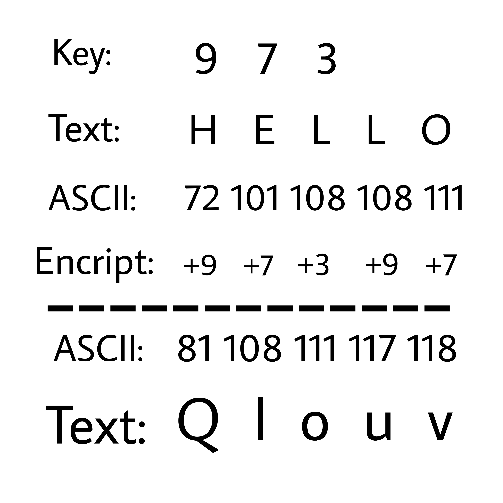

# Encrypt.js  [](https://opensource.org/licenses/Apache-2.0)

**This repo is obsolete, update your encrypt system to the version v2. Please read [https://github.com/ZhengLinLei/encrypt-charcode-num-v2](https://github.com/ZhengLinLei/encrypt-charcode-num-v2) and check the new features added. Although you can read this documentation to be understanding the basics of encryption of this system**

## How it does work?

Needs to input.
1. Key [ Arr(Int) | Str ]
2. Text [ Str | Int ]

First you need a key and then the system will use the key array to encrypt/decrypt the string, see the image graphic below.




# Javascript use

File script `script.js`. You can add it by `html` or with `node`
```html
<script src="./src/script.js"></script>
```

If you are going to use `node`, please remove the comment from the main script file, in the last line.

## Table of content

1. [Class](#class)
2. [Change key](#change-key)
3. [Encrypt content](#encrypt)
4. [Dencrypt content](#dencrypt)
5. [Examples of code](#example)

## 1. <a name="class"></a> Class

First want to init a variable
```javascript
let ClassChar = new KeyStr([...])
```

The class need two parameters.
1. Key [Str]
2. Split [Str] : Default = ','
```javascript
let ClassChar = new KeyStr('10|30|11', '|') // SPLIT THE TEXT WITH '|'
```

## 2. <a name="change-key"></a> Change key

If you want to change the key, you can do it with `changeKey()` method.
```javascript
ClassChar.changeKey('2,8', ',') // THIS MUST CHANGE THE KEY FROM [10, 30, 11] TO [2, 800]
```

## 3. <a name="encrypt"></a> Encrypt content

The `encryptStr()` method help you to encrypt the text, there a two ways to encrypt. One by temporal key or with the key were was initialized.
```javascript
// IN THIS CASES WILL USE THE KEY INIALIZATED BEFORE
// key = [2, 8]

console.log(ClassChar.encryptStr('Hello'))
// Return: Jmntq

// ====================================

// OR YOU CAN USE THE TEMPORAL KEY
// THE SYNTAX MUST BE
// [str, split]

console.log(ClassChar.encryptStr('Hello', ['8|3|1', '|']))
// Return: Phmtr

```

## 4. <a name="dencrypt"></a> Dencrypt content

And if you want to dencrypt you can do it with `dencryptStr()` method, there a two ways to encrypt. One by temporal key or with the key were was initialized.
```javascript
// IN THIS CASES WILL USE THE KEY INIALIZATED BEFORE
// key = [2, 8]

console.log(ClassChar.dencryptStr('Jmntq'))
// Return: Hello

// ====================================

// OR YOU CAN USE THE TEMPORAL KEY
// THE SYNTAX MUST BE
// [str, split]

console.log(ClassChar.dencryptStr('Phmtr', ['8|3|1', '|']))
// Return: Hello

```


## 5. <a name="example"></a> Examples of code

```javascript
let CharVar = new KeyStr('0')

console.log(CharVar.encryptStr('Hello world!', ['20 10 30', ' ']))
// \oŠ€y>‹y€n?

console.log(CharVar.dencryptStr('\oŠ€y>‹y€n?', ['20 10 30', ' ']))
// Hello world!
```


<br><br><br>

# Fix some bugs

If you are using terminal to debugging, in some cases the text doesn't be displayed correctly, like `Š€` or some other characters.

### How to fix it?

Use your browser console for debugging, and will display some characters were in terminal doesn't be displayed.


<br><br><br>

### Love this repo? Give us a star ⭐

<a href="./">
  
</a>
